# Messenger

Production-oriented messenger backend written in Go as a learning project. The
codebase focuses on explicit domain invariants, transaction boundaries,
concurrency safety, and integration-tested PostgreSQL repositories.

> [!NOTE]
> Authentication and user account management are implemented. Chats and
> messages are under active development; their database schema is still being
> finalized before the direct-chat use case is implemented.

## Implemented

- Registration, login, refresh-token rotation, and logout.
- Stateful sessions stored in PostgreSQL.
- Password changes with compare-and-swap and session revocation.
- Case-insensitive usernames with display casing preserved.
- User profile reads and partial updates.
- Account anonymization with atomic session revocation.
- Row-level locking for profile updates, account deletion, and the final login
  check.
- Unit tests and PostgreSQL integration tests.

## Stack

- Go 1.26
- Chi
- PostgreSQL 18
- pgx
- JWT access tokens and stateful refresh sessions
- Docker Compose
- Zap
- Testify and Mockery

## Architecture

The repository uses a feature-first layout. Each feature owns its use cases,
transport contracts, and persistence implementation. Shared technical building
blocks and domain types live under `internal/core`.

```text
.
├── cmd
│   └── messenger          # composition root and application entrypoint
├── internal
│   ├── core
│   │   ├── auth           # token, password, and cookie primitives
│   │   ├── domain         # entities, value objects, and invariants
│   │   ├── postgres       # pool, transactions, and pgx helpers
│   │   └── transport      # reusable HTTP infrastructure
│   └── features
│       ├── auth           # credentials and session lifecycle
│       ├── users          # profiles and account lifecycle
│       └── chats          # chats and messages (in progress)
├── docs                   # editable and rendered diagrams
├── migrations             # ordered PostgreSQL migrations
├── docker-compose.yaml
├── Makefile
└── README.md
```

Repository interfaces are declared by the consuming service. Transactions are
orchestrated by use cases and propagated to repositories through `context.Context`.

## Database



The direct/group subtype invariant, direct participant membership, and
same-chat constraints for `last_message_id` and `last_read_message_id` are not
yet enforced by the current migration. They will be resolved before chat
creation is considered complete.

## HTTP API

All routes are mounted under `/api/v1`.

| Method | Route | Authentication | Purpose |
| --- | --- | --- | --- |
| `POST` | `/auth/register` | No | Create a user and initial session |
| `POST` | `/auth/login` | No | Authenticate and create a session |
| `POST` | `/auth/refresh` | Refresh cookie | Rotate the refresh token |
| `POST` | `/auth/logout` | Refresh cookie | Revoke the current session |
| `PUT` | `/auth/password` | Access token | Change password and revoke sessions |
| `GET` | `/users/me` | Access token | Get the current user |
| `GET` | `/users/{id}` | Access token | Get an active user |
| `PATCH` | `/users/me` | Access token | Partially update the profile |
| `DELETE` | `/users/me` | Access token | Anonymize the account and revoke sessions |

Refresh tokens are stored in an `HttpOnly` cookie. Access tokens are returned
in the response body and supplied through the authorization middleware.

## Running locally

The Makefile reads configuration from `.env`. Start PostgreSQL, expose it to
the host, apply migrations, and run the API:

```sh
make env-up
make env-port-forward
make migrate-up
make run
```

To run the application container instead:

```sh
make deploy
```

## Tests

Run the unit suite:

```sh
make test-unit
```

Run PostgreSQL integration tests against the dedicated test database:

```sh
make env-up
make env-port-forward
make test-env-up
make test-migrate-up
make test-integration
make test-env-down
```

Integration tests use the `integration` build tag and execute against real
PostgreSQL constraints, transactions, and row locks.
