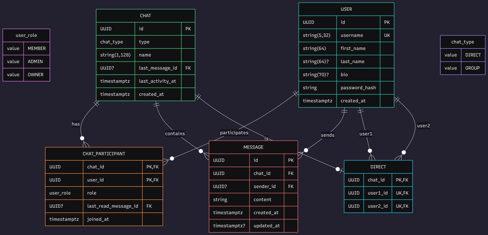

# Messenger


A modern messenger backend written in Go.

## Tech Stack

- Go
- Chi
- PostgreSQL
- pgx
- JWT
- Docker

## Features


- Authentication
- Chats
- Messages
- User management


## API
```
/auth
    POST /register
    POST /login
    POST /refresh
    POST /logout

/users
    GET    /
    GET    /me
    GET    /{id}
    PATCH  /me
    DELETE /me
    PUT    /me/password

/avatars
    POST   /
    DELETE /

/chats
    GET /
    GET /{id}
/messages
```