# Database

[Back to README](../README.md)

The executable schema is in `migrations/*.up.sql`. The Mermaid source is
[database.mmd](database.mmd); the diagram is a summary, not a replacement for SQL.
`?` marks nullable fields. Multiple `UK` field markers can belong to one composite
constraint: `messages.sender_id` is **not** individually unique.

## Tables

| Table | Responsibility |
| --- | --- |
| `users` | Account, inline profile fields, password hash, soft-deletion timestamp |
| `sessions` | User sessions, current refresh token ID, usage and expiry times |
| `chats` | Common direct/group identity, activity time, last-message pointer |
| `directs` | Canonically ordered pair of users for a direct chat |
| `groups` | Group-specific title |
| `chat_participants` | Membership identity, join time, read-message pointer |
| `group_participants` | Group membership subtype and role |
| `messages` | Text, author, retry key, creation and edit timestamps |

`UserProfile` is a separate domain type, but its fields are stored in `users`,
not in a separate profile table.

## Database-enforced rules

- Usernames retain their casing; a unique index on `lower(username)` prevents
  case-insensitive duplicates.
- `directs` has `UNIQUE(user1_id, user2_id)` and `CHECK(user1_id < user2_id)`.
  This prevents duplicate pairs and self-directs.
- Messages have `UNIQUE(sender_id, client_message_id)`: retry keys are scoped to
  the sender, not to each chat.
- Membership has composite identity `(chat_id, user_id)`. Group membership
  references both its group and the corresponding common membership row.
- Foreign keys protect referenced IDs. Additional checks constrain profile
  fields, session timestamps, group title, and message length.

## Application-owned rules and limitations

- SQL alone does not enforce exactly one matching direct/group subtype per chat
  or equality between a direct's pair and its participant rows. Creation use
  cases and repositories maintain these relationships transactionally.
- Message pointers reference existing messages, but their foreign keys do not
  enforce that the referenced message belongs to the same chat. The application
  must preserve that invariant.
- Active-account checks and role permissions belong to use cases. Not every
  check locks the account or membership against concurrent changes.
- Accounts are anonymized rather than physically removed, preserving authorship
  and history references; sessions are revoked as part of account deletion.
- Messages are physically deleted. The deletion use case repairs affected read
  markers and the last-message pointer before deletion. The current foreign keys
  are **not** `ON DELETE SET NULL`; raw SQL deletion can fail while references
  remain. Deletion does not move `last_activity_at` backwards.

## Migrations

The current sequence is `000001_init` (users), `000002_sessions`, and
`000003_chats` (chats, messages, membership, and indexes).

Use a new migration to evolve an already-deployed schema. Editing an applied
initial migration changes fresh installations only; it does not update an
existing database. See [development](development.md) for local and test setup.
